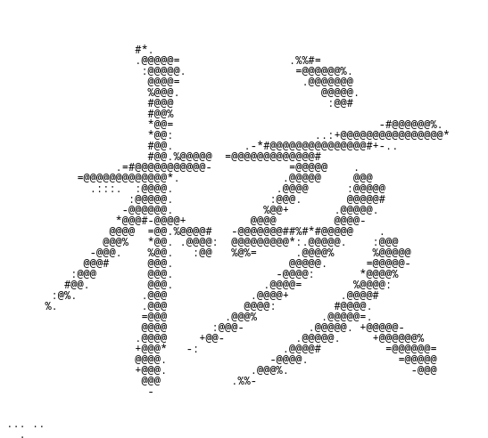

# kaku - kernel - v0.0.5

Basic bootloader & kernel (x86 32bit)

 
***
 
Now:
- [boot.asm](bootloader/boot.asm): the bootloader starts the kernel
- (deprecated) [vga.h](kernel/hw/vga/vga.h): the kernel write a basic message via VGA
- [idt.h](kernel/hw/idt/idt.h): IDT table for legacy intel interruptions
- [pic.h](kernel/hw/pic/pic.h): IDT table for PIC (keyboard & IO)
- [kb.h](kernel/hw/kb/kb.h): writes what you type directly in the TTY, no backspace for now
- [alloc.h](kernel/alloc/alloc.h): buddy memory allocator for the kernel (used by kmalloc & kfree) for allocation on the heap
- [frame.h](kernel/frame/frame.h): frame allocator to segment free memory (after the heap) into blocks of 4kb
- [paging.h](kernel/paging/paging.h): paging for virtual memory addresses, with, for the kernel its own page directory, required for future processes isolation in memory
- [proc.h](kernel/proc/proc.h): processes functionning with a basic entry function with no args neither return value
- [serial.h](kernel/hw/serial/serial.h): serial output available for writing on stdio with QEMU, mostly for debugging purposes
- [sched.h](kernel/proc/sched.h): basic round robin process scheduler
- [ata.h](kernel/disk/ata/ata.h): simple ATA PIO driver (primary disk only) to read and write on disk
- [ext2.h](kernel/fs/ext2/ext2.h): `ext2fs` implementation: can read, write, edit files (cannot delete yet)
- [vesa.h](kernel/hw/vesa/vesa.h): VESA 1024x768 display with 8 bits colors
- [tty.h](kernel/tty/tty.h): basic TTY which can scroll, with a backbuffer
- [vfs.h](kernel/vfs/vfs.h): VFS interface to (with an ext2 driver)

Coming:
- Kernel internal logging system for infos & debugging, to be extracted from the VM (serial output for now)
- Repair IOs (VGA & Serial, TTY to check) for weird race condition from processes (will be fixed when doing syscalls)
- A basic shell interface with some programs built-in (in progress)
- Syscalls interface for future userspace (in progress) 

See [Makefile](Makefile) to build the image and run it with QEMU.

You will need few things to run it:
- `i686-elf-gcc` to compile the kernel
- `nasm` to assemble the bootloader
- `i686-elf-ld` for the linker
- QEMU to run everything
